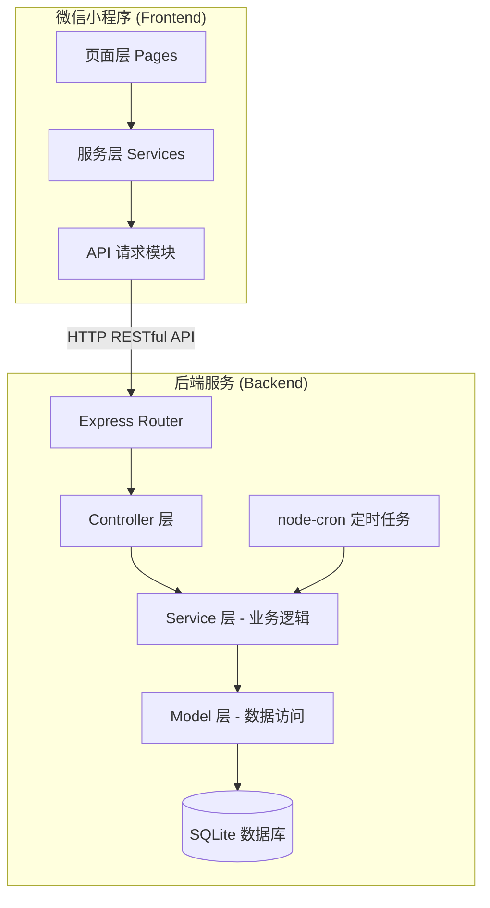
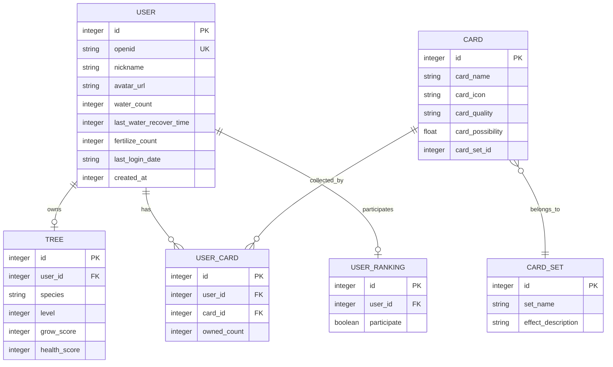

# 技术设计文档：种树游戏

## 概述 (Overview)

种树游戏是一个微信小程序游戏，用户选择树种后通过浇水和施肥推动树的成长，同时收集卡牌并参与排行榜竞争。系统采用前后端分离架构：前端为微信小程序（负责 UI 展示和请求发送），后端为本地部署的 Node.js 服务（负责数据存储和业务逻辑）。

### 技术选型

| 层级 | 技术 | 理由 |
|------|------|------|
| 前端 | 微信小程序原生框架 | 项目已初始化为原生小程序，保持一致性 |
| 后端 | Node.js + Express | 与前端 JS 生态统一，轻量高效 |
| 数据库 | SQLite | 本地部署、零配置、适合单机游戏后端 |
| ORM | better-sqlite3 | 同步 API，性能优秀，适合 SQLite |
| 定时任务 | node-cron | 轻量级定时任务，用于每日结算 |
| 测试 | Vitest + fast-check | 现代测试框架 + 属性测试库 |

### 设计决策

1. **SQLite 而非 MySQL/PostgreSQL**：本地部署场景下 SQLite 零配置、无需额外进程，足以支撑单机游戏数据量。
2. **同步 better-sqlite3 而非异步 sqlite3**：游戏逻辑为顺序操作，同步 API 代码更简洁，性能更优。
3. **Express 而非 Koa/Fastify**：生态成熟、文档丰富，适合快速开发。
4. **浇水次数恢复采用惰性计算**：不使用定时器为每个用户恢复浇水次数，而是在用户请求时根据时间差计算当前可用次数，减少服务器负载。

## 架构 (Architecture)



### 前端架构

```
miniprogram/
├── app.js                  # 应用入口，全局登录逻辑
├── app.json                # 页面路由配置
├── services/
│   └── api.js              # 统一 API 请求封装
├── pages/
│   ├── index/              # 主页面（树的展示、浇水、施肥）
│   ├── select-tree/        # 选择树种页面
│   ├── cards/              # 卡牌收集页面
│   └── ranking/            # 排行榜页面
└── utils/
    └── util.js             # 工具函数
```

### 后端架构

```
server/
├── index.js                # 服务入口
├── config.js               # 游戏配置参数
├── db/
│   ├── init.js             # 数据库初始化
│   └── tree-game.db        # SQLite 数据库文件
├── middleware/
│   └── auth.js             # 用户身份验证中间件
├── routes/
│   ├── user.js             # 用户相关路由
│   ├── tree.js             # 树操作路由
│   ├── card.js             # 卡牌路由
│   ├── ranking.js          # 排行榜路由
│   └── test.js             # 测试工具路由
├── controllers/
│   ├── userController.js
│   ├── treeController.js
│   ├── cardController.js
│   ├── rankingController.js
│   └── testController.js
├── services/
│   ├── userService.js      # 用户业务逻辑
│   ├── treeService.js      # 树操作业务逻辑（浇水、施肥、升级）
│   ├── cardService.js      # 卡牌业务逻辑
│   ├── rankingService.js   # 排行榜业务逻辑
│   ├── settlementService.js # 每日结算逻辑
│   └── wateringTimerService.js # 浇水次数恢复计算
├── models/
│   ├── userModel.js
│   ├── treeModel.js
│   ├── cardModel.js
│   └── rankingModel.js
├── jobs/
│   └── dailySettlement.js  # 每日结算定时任务
└── tests/
    ├── services/           # Service 层单元测试
    └── properties/         # 属性测试
```

## 组件与接口 (Components and Interfaces)

### RESTful API 接口设计

#### 用户模块

| 方法 | 路径 | 说明 | 请求体 | 响应 |
|------|------|------|--------|------|
| POST | /api/user/login | 微信登录 | `{ code: string }` | `{ token, userData }` |
| GET | /api/user/info | 获取用户信息 | - | `{ user }` |

#### 树操作模块

| 方法 | 路径 | 说明 | 请求体 | 响应 |
|------|------|------|--------|------|
| POST | /api/tree/select | 选择树种 | `{ species: string }` | `{ success }` |
| POST | /api/tree/water | 浇水 | - | `{ growScore, waterCount, card? }` |
| POST | /api/tree/fertilize | 施肥 | - | `{ healthScore, fertilizeCount }` |
| GET | /api/tree/status | 获取树状态 | - | `{ tree }` |

#### 卡牌模块

| 方法 | 路径 | 说明 | 请求体 | 响应 |
|------|------|------|--------|------|
| GET | /api/cards | 获取用户卡牌列表 | - | `{ cards, sets }` |
| GET | /api/cards/sets | 获取套装完成状态 | - | `{ sets }` |

#### 排行榜模块

| 方法 | 路径 | 说明 | 请求体 | 响应 |
|------|------|------|--------|------|
| GET | /api/ranking/all | 获取总排行榜 | - | `{ rankings }` |
| GET | /api/ranking/friends | 获取好友排行榜 | - | `{ rankings }` |
| POST | /api/ranking/toggle | 切换排名参与状态 | `{ participate: boolean }` | `{ success }` |

#### 测试工具模块

| 方法 | 路径 | 说明 | 请求体 | 响应 |
|------|------|------|--------|------|
| POST | /api/test/fake-user | 添加假人用户 | `{ species, growScore, cards }` | `{ userId }` |

### 核心 Service 接口

```javascript
// treeService.js
class TreeService {
  selectSpecies(userId, species)    // 选择树种
  water(userId)                     // 浇水：扣次数、加成长值、判定卡牌、判定升级
  fertilize(userId)                 // 施肥：扣次数、加健康值（上限100）
  getStatus(userId)                 // 获取树状态（含计算后的浇水次数）
}

// wateringTimerService.js
class WateringTimerService {
  calculateAvailableWaterCount(userId)  // 惰性计算当前可用浇水次数
  consumeWaterCount(userId)             // 消耗一次浇水机会
}

// cardService.js
class CardService {
  tryGainCard(userId)               // 尝试获得卡牌（概率判定 + 加权随机）
  getUserCards(userId)              // 获取用户卡牌列表
  checkSetCompletion(userId)       // 检查套装完成状态
}

// settlementService.js
class SettlementService {
  executeDailySettlement()          // 执行每日结算（所有用户）
  settleUser(userId)               // 单用户结算逻辑
}

// rankingService.js
class RankingService {
  getAllRanking()                   // 获取总排行榜
  getFriendsRanking(userId)        // 获取好友排行榜
  toggleParticipation(userId, participate)  // 切换排名参与
}
```

### 浇水次数惰性计算逻辑

```javascript
// 不使用定时器，而是在请求时计算
function calculateAvailableWaterCount(user) {
  const now = Date.now();
  const elapsed = now - user.last_water_recover_time;
  const recovered = Math.floor(elapsed / WATERING_RESUME_INTERVAL);
  const currentCount = Math.min(
    user.water_count + recovered,
    MAX_WATERING_TIME
  );
  return { currentCount, newRecoverTime };
}
```

## 数据模型 (Data Models)

### ER 图



### 数据库表结构

#### users 表

| 字段 | 类型 | 说明 |
|------|------|------|
| id | INTEGER PRIMARY KEY | 用户 ID |
| openid | TEXT UNIQUE | 微信 openid |
| nickname | TEXT | 昵称 |
| avatar_url | TEXT | 头像 URL |
| water_count | INTEGER | 当前浇水次数 |
| last_water_recover_time | INTEGER | 上次浇水恢复时间戳(ms) |
| fertilize_count | INTEGER | 当前施肥次数 |
| last_login_date | TEXT | 上次登录日期(YYYY-MM-DD) |
| created_at | INTEGER | 创建时间戳 |

#### trees 表

| 字段 | 类型 | 说明 |
|------|------|------|
| id | INTEGER PRIMARY KEY | 树 ID |
| user_id | INTEGER UNIQUE | 用户 ID (外键) |
| species | TEXT | 树种: apple/cherry/oak |
| level | INTEGER DEFAULT 0 | 当前等级 |
| grow_score | INTEGER DEFAULT 0 | 成长值 |
| health_score | INTEGER DEFAULT 30 | 健康值(0-100) |

#### cards 表

| 字段 | 类型 | 说明 |
|------|------|------|
| id | INTEGER PRIMARY KEY | 卡牌 ID |
| card_name | TEXT | 卡牌名称 |
| card_icon | TEXT | 卡牌图标路径 |
| card_quality | TEXT | 品质: common/rare/epic/legendary |
| card_possibility | REAL | 加权随机权重 |
| card_set_id | INTEGER | 所属套装 ID (-1 表示无套装) |

#### card_sets 表

| 字段 | 类型 | 说明 |
|------|------|------|
| id | INTEGER PRIMARY KEY | 套装 ID |
| set_name | TEXT | 套装名称 |
| effect_description | TEXT | 特殊效果描述 |

#### user_cards 表

| 字段 | 类型 | 说明 |
|------|------|------|
| id | INTEGER PRIMARY KEY | 记录 ID |
| user_id | INTEGER | 用户 ID (外键) |
| card_id | INTEGER | 卡牌 ID (外键) |
| owned_count | INTEGER DEFAULT 0 | 拥有数量 |

#### user_rankings 表

| 字段 | 类型 | 说明 |
|------|------|------|
| id | INTEGER PRIMARY KEY | 记录 ID |
| user_id | INTEGER UNIQUE | 用户 ID (外键) |
| participate | INTEGER DEFAULT 0 | 是否参与排名 (0/1) |

### 游戏配置 (config.js)

```javascript
module.exports = {
  DAILY_FERTILIZE_RESUME_TIMES: 1,
  MAX_FERTILIZE_COUNT: 1,
  USER_FERTILIZE_RECOVER_EFFECT: 25,
  DAILY_DECLINE_HEALTH_SCORE: 20,
  LOW_HEALTH_SCORE: 20,
  WATERING_RESUME_INTERVAL: 1800 * 1000, // 30分钟，毫秒
  MAX_WATERING_TIME: 50,
  GAIN_CARD_POSSIBILITY: 0.1,
  UPGRADE_NEED_GROW_SCORE: [0, 100, 300, 600, 1000, 1500, 2100, 2800, 3600, 4500, 5500],
  TREE_SPECIES: ['apple', 'cherry', 'oak'],
};
```

## 正确性属性 (Correctness Properties)

*属性（Property）是一个在系统所有有效执行中都应成立的特征或行为——本质上是对系统应做什么的形式化陈述。属性是人类可读规范与机器可验证正确性保证之间的桥梁。*

### Property 1: 浇水次数惰性计算正确性

*For any* 用户初始浇水次数 `w`（0 ≤ w ≤ max_watering_time）和任意经过时间 `t`（t ≥ 0），计算后的可用浇水次数应等于 `min(w + floor(t / watering_resume_interval), max_watering_time)`。

**Validates: Requirements 3.1, 3.2**

### Property 2: 浇水操作状态变更正确性

*For any* 拥有浇水次数 > 0 且已选择树种的用户，执行浇水操作后：浇水次数减少 1，成长值增加正整数值，且浇水次数为 0 时操作应被拒绝。

**Validates: Requirements 3.3, 3.4**

### Property 3: 施肥健康值计算正确性

*For any* 拥有施肥次数 > 0 的用户和任意初始健康值 `h`（0 ≤ h ≤ 100），执行施肥后健康值应等于 `min(h + user_fertilize_recover_effect, 100)`，且施肥次数减少 1。

**Validates: Requirements 4.3, 4.4, 4.5**

### Property 4: 每日施肥次数恢复逻辑

*For any* 用户，若当前日期与上次登录日期不同，则施肥次数应恢复 `daily_fertilize_resume_times`（但不超过 `max_fertilize_count`）；若日期相同，施肥次数不变。

**Validates: Requirements 4.1, 4.2**

### Property 5: 等级计算一致性

*For any* 非负成长值 `g` 和升级阈值配置 `upgrade_need_grow_score`，计算出的等级应为满足 `upgrade_need_grow_score[level] ≤ g` 的最大 `level`。此属性同时覆盖升级和降级场景。

**Validates: Requirements 5.1, 5.2, 6.5**

### Property 6: 每日结算正确性

*For any* 用户初始状态（健康值 `h`，成长值 `g`，等级 `l`），执行每日结算后：
1. 新健康值 = max(h - daily_decline_health_score, 0)
2. 若新健康值 < low_health_score，则成长值扣除量 = (upgrade_need_grow_score[l+1] - upgrade_need_grow_score[l]) * 10%，新成长值 = max(g - 扣除量, 0)
3. 新等级应与新成长值按 Property 5 的规则一致

**Validates: Requirements 6.1, 6.2, 6.3, 6.4, 6.5**

### Property 7: 卡牌获取数量递增

*For any* 用户和任意卡牌，当系统判定该用户获得该卡牌时，该用户对应卡牌的 `owned_count` 应恰好增加 1，其他卡牌的数量不变。

**Validates: Requirements 7.3**

### Property 8: 套装完成判定正确性

*For any* 套装和任意用户的卡牌拥有状态，套装完成当且仅当该套装中每张卡牌的 `owned_count ≥ 1`。

**Validates: Requirements 8.2**

### Property 9: 排行榜可见性一致性

*For any* 用户集合和各自的排名参与状态，排行榜返回的用户列表应恰好包含所有 `participate = true` 的用户，且不包含任何 `participate = false` 的用户。切换状态后立即查询应反映最新状态。

**Validates: Requirements 9.1, 9.2, 9.5**

## 错误处理 (Error Handling)

### 前端错误处理

| 场景 | 处理方式 |
|------|----------|
| 网络请求失败 | 显示 Toast 提示"网络异常，请重试"，不改变本地状态 |
| Token 过期 | 自动重新调用 wx.login 获取新 token，重试原请求 |
| 服务端返回业务错误 | 根据错误码显示对应提示信息 |
| 浇水/施肥次数不足 | 禁用按钮，显示恢复倒计时或提示 |

### 后端错误处理

| 场景 | HTTP 状态码 | 错误码 | 说明 |
|------|-------------|--------|------|
| 未认证请求 | 401 | AUTH_REQUIRED | 缺少或无效 token |
| 未选择树种就操作 | 400 | TREE_NOT_SELECTED | 需先选择树种 |
| 浇水次数不足 | 400 | NO_WATER_COUNT | 浇水次数为 0 |
| 施肥次数不足 | 400 | NO_FERTILIZE_COUNT | 施肥次数为 0 |
| 无效树种 | 400 | INVALID_SPECIES | 树种不在允许列表中 |
| 重复选择树种 | 400 | SPECIES_ALREADY_SELECTED | 已选择过树种 |
| 数据库错误 | 500 | INTERNAL_ERROR | 内部错误，记录日志 |

### 错误响应格式

```json
{
  "success": false,
  "error": {
    "code": "NO_WATER_COUNT",
    "message": "浇水次数不足，请等待恢复",
    "data": {
      "nextRecoverTime": 1700000000000
    }
  }
}
```

### 并发与一致性

- 浇水和施肥操作使用数据库事务保证原子性
- 每日结算使用批量事务处理，单用户结算失败不影响其他用户
- 浇水次数惰性计算在写入时使用乐观锁（检查 last_water_recover_time 未变化）

## 测试策略 (Testing Strategy)

### 属性测试 (Property-Based Testing)

**框架选择：** Vitest + fast-check

**配置要求：**
- 每个属性测试最少运行 100 次迭代
- 每个测试标注对应的设计文档属性编号
- 标签格式：`Feature: tree-growing-game, Property {number}: {property_text}`

**属性测试覆盖范围：**

| 属性 | 测试目标 | 生成器 |
|------|----------|--------|
| Property 1 | wateringTimerService.calculateAvailableWaterCount | 随机初始次数(0-50) + 随机时间差(0-86400000ms) |
| Property 2 | treeService.water | 随机用户状态（有/无浇水次数，有/无树种） |
| Property 3 | treeService.fertilize | 随机初始健康值(0-100) + 随机施肥次数(0-1) |
| Property 4 | userService.checkAndRecoverFertilize | 随机日期对（相同/不同天） |
| Property 5 | treeService.calculateLevel | 随机成长值(0-10000) |
| Property 6 | settlementService.settleUser | 随机初始状态（健康值、成长值、等级） |
| Property 7 | cardService.addCardToUser | 随机用户 + 随机卡牌 |
| Property 8 | cardService.checkSetCompletion | 随机套装配置 + 随机拥有状态 |
| Property 9 | rankingService.getAllRanking | 随机用户集合 + 随机参与状态 |

### 单元测试 (Unit Tests)

**框架：** Vitest

**覆盖范围：**
- 用户创建初始化值验证
- 树种选择边界条件（无效树种、重复选择）
- 浇水/施肥次数为 0 时的拒绝逻辑
- 卡牌加权随机选择的边界情况（单卡牌、全零权重）
- 每日结算的具体数值验证
- 身份验证中间件（有效/无效/缺失 token）

### 集成测试 (Integration Tests)

**覆盖范围：**
- API 端点可访问性和响应格式
- 完整浇水流程（登录 → 选树 → 浇水 → 验证状态）
- 完整施肥流程
- 排行榜数据一致性
- 测试工具接口功能验证

### 测试目录结构

```
server/tests/
├── properties/
│   ├── watering-timer.property.test.js    # Property 1
│   ├── watering-operation.property.test.js # Property 2
│   ├── fertilize.property.test.js          # Property 3
│   ├── fertilize-recover.property.test.js  # Property 4
│   ├── level-calculation.property.test.js  # Property 5
│   ├── daily-settlement.property.test.js   # Property 6
│   ├── card-acquisition.property.test.js   # Property 7
│   ├── card-set-completion.property.test.js # Property 8
│   └── ranking-visibility.property.test.js  # Property 9
├── unit/
│   ├── userService.test.js
│   ├── treeService.test.js
│   ├── cardService.test.js
│   └── authMiddleware.test.js
└── integration/
    ├── api.test.js
    └── workflow.test.js
```

